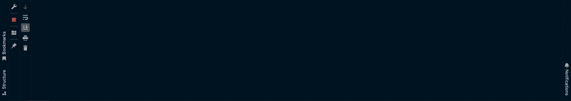

# Neural Network From Scratch in Python
This project aims to implement a neural network library from scratch using Python, based on the concepts and techniques outlined in the book "Neural Network from Scratch in Python" by Harrison Kinsley. 

## Difficulties
The biggest challenge when creating this project is to implent the mathematics of each chapter into coding. In the first chapter, I was able understand how the output was created by implementing dot products. However, as I go further, more complex topic such as backpropagation, gradient decent, loss, optimization, and regression are impossible to implement without the use of gradients and partial derivatives. For the sake of clarity, I wrote out some comments at the start of every chapter to know what is the purpose and functionality of the following function I am going to implement. 

In addition, I only use some of the functions in the main program in order to optimize the accuracy of the neural network:
- Activation function: ReLU (Rectified Linear Activation Function) and Softmax
- Accuracy: Categorical 
- Loss: Categorical Cross Entropy
- Optimizer: Adam

## Features
- Generating Layers: The program enables to compute weights and biases of each neuron, manually inputting number of neurons per layers, and generate outputs.
- Backpropagation algorithm: Backpropagation is implemented to calculate gradients, update weights and biases, and modify the network's performance during the training process.
- Activation functions: The program supports a range of activation functions, including Sigmoid, (Rectified Linear Activation) ReLU, and Softmax, allowing users to experiment with different non-linearities.
- Gradient descent optimization: The library incorporates gradient descent optimization algorithms, such as Stochastic Gradient Descent (SGD), Adaptive Gradient (Adagrad), Root Mean Square Propagation (RMSProp), and Adaptive Momentum (Adam) to efficiently minimize the network's loss function.

## Illustration
Below is an illustration of running the neural network with categorical cross-entropy loss, Adam optimizer, and categorical accuracy.

## Pre-requisite
In order to get a better understanding of the project, you need to have prior knowledge in the following subjects:
- Mathematics: Linear Algebra, Calculus III (Multivariable Calculus)
- Programming: NumPy and Python

## Acknowledgments
The implementation of this neural network library draws from the book "Neural Network from Scratch in Python" by Harrison Kinsley. Special thanks to the author for providing valuable insights in understanding and implementing the neural network library, and to my friend Eric who had introduced me this amazing book.
